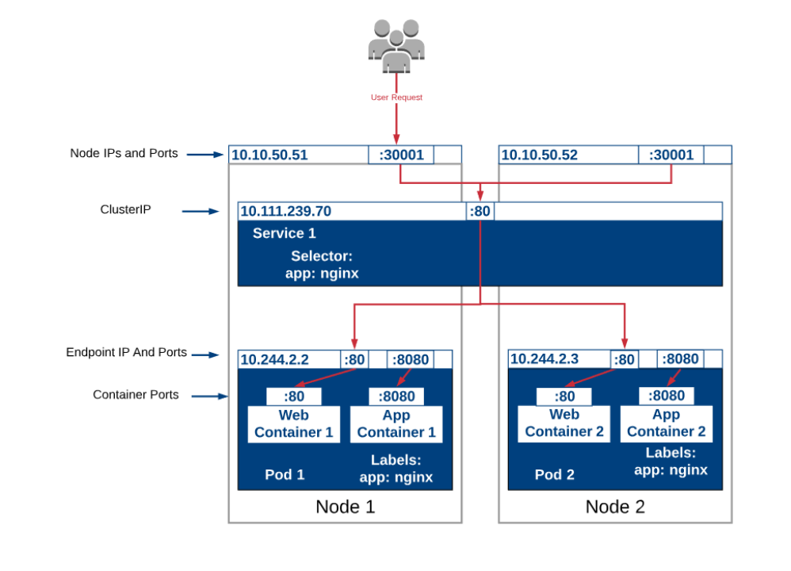
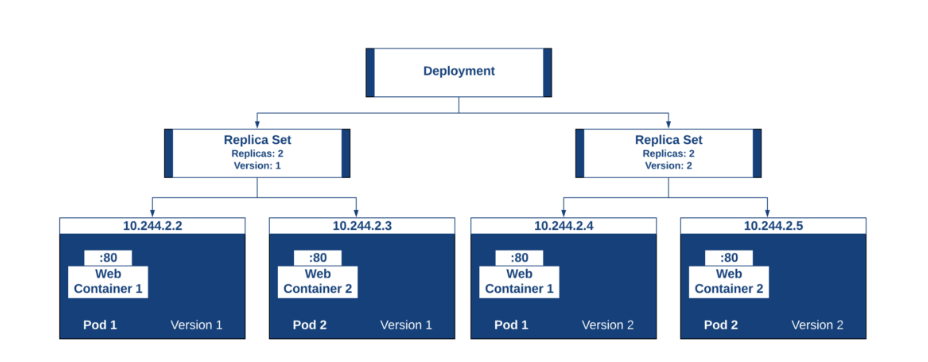
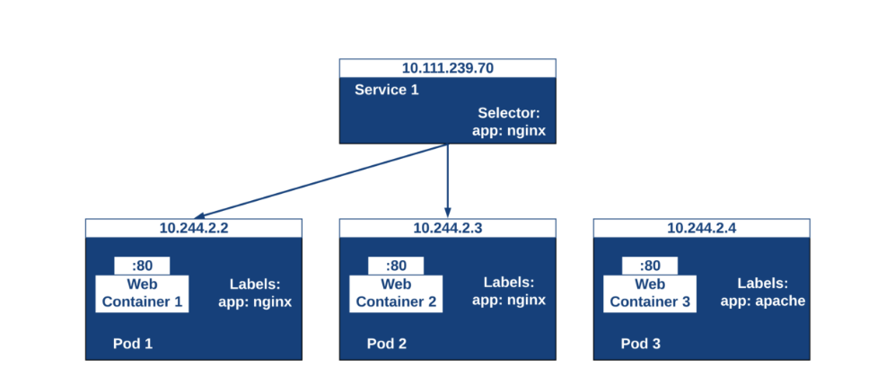

### Kubernetes Important Points

- A pod can have multiple containers, but each container must use different port numbers.
- Every pod receives a unique IP address.
- In a Service definition, if you specify a selector like `app=nginx`, and in the Deployment workload, you label the pod with `app=nginx`, the Service will automatically connect to the pods with the matching selector.

```yaml
# Example of a Service file
apiVersion: v1
kind: Service
metadata:
  name: my-service
spec:
  selector:
    app: nginx
  ports:
    - protocol: TCP
      port: 80
      targetPort: 80
```

```yaml
# Example of a Deployment file
apiVersion: apps/v1
kind: Deployment
metadata:
  name: my-deployment
spec:
  replicas: 3
  selector:
    matchLabels:
      app: nginx
  template:
    metadata:
      labels:
        app: nginx
    spec:
      containers:
        - name: nginx
          image: nginx
          ports:
            - containerPort: 80
```

In this example, the Service will automatically connect to the pods created by the Deployment because they share the same `app: nginx` label.


## services in k8s




# Kubernetes – Pods
##           Pods – The Theory

In a Docker environment, the smallest unit you deal with is a container. In the Kubernetes world, you work with a pod, which consists of one or more containers. You cannot deploy a bare container in Kubernetes without it being deployed within a pod.

The pod provides several things to the containers running within it, including options on how the container should run, any storage resources, and a network namespace. The pod encapsulates these for the containers that run inside them.
### Single Container Pods
  
The simplest way to get your containers deployed in Kubernetes is the one container per pod approach.

### Multi-container Pods

In Kubernetes, you work with pods, which consist of one or more containers. You cannot deploy a bare container without a pod.

Pods provide containers with runtime options, storage resources, and a network namespace. Containers within the same pod are tightly coupled, often sharing storage or implementing patterns like a service mesh with sidecar containers.

All containers in a pod share the same network namespace, meaning they share an IP address and must use different ports. Containers in the same pod can communicate via `localhost`.

A pod is only healthy if all its containers are ready. If one container is unhealthy, the entire pod deployment will fail.

## ways of deployments

there are two ways to deploy objects in Kubernetes. The first way
is through the command line and the second is through a manifest file.


### deploying nginx pod (naked pod)

```yaml
apiVersion: v1 #version of the API to use
kind: Pod #What kind of object we're deploying
metadata: #information about our object we're deploying
  name: nginx-pod
spec: #specifications for our object
  containers:
  - name: nginx-container #the name of the container within the pod
    image: nginx #which container image should be pulled
    ports:
    - containerPort: 80 #the port of the container within the pod

```
### To get pods 

```bash 
kubectl get pods
```
### To describe pod in detail 

```bash
kubectl describe pod pod_name

```

Deploying naked pods in production is discouraged due to their inherent unreliability. Naked pods, or pods without higher-level controllers managing them, are unsuitable for several reasons:

### Main Reasons:
1. **Lack of Reliability:**
   - **No Guaranteed Uptime:** If a pod crashes, Kubernetes does not automatically restart it, leading to potential downtime.
   - **Node Failures:** If the node fails, the pod fails too and isn't automatically rescheduled on a healthy node.
   - **Resource Constraints:** Pods can be terminated if they run out of resources and won't restart automatically, disrupting services.
   - **Manual Intervention Required:** Any failure requires manual intervention, which is not ideal for maintaining high uptime and reliability in production.

Using higher-level controllers like Deployments or ReplicaSets ensures automatic recovery and reliability, making them essential for production environments.
## Replica Sets
A ReplicaSet in Kubernetes ensures a specified number of pod replicas are running at any given time. It maintains the desired number of identical pods, replacing any that fail or are deleted, to ensure application availability and fault tolerance.


Naked pods lack reliability as they don't automatically restart if they fail, leading to potential downtime. Using ReplicaSets ensures high availability by maintaining the desired number of running pods and automatically replacing any failed ones.

```yaml
apiVersion: apps/v1 # Specifies the API version
kind: ReplicaSet # Defines the kind of object, in this case, a ReplicaSet
metadata:
  name: nginx-replicaset # Name of the ReplicaSet
spec:
  replicas: 2 # Specifies the desired number of pod replicas
  selector: # Selector to identify which pods the ReplicaSet is responsible for
    matchLabels:
      app: nginx # Pods with this label will be managed by this ReplicaSet
  template: # Template for the pods that will be created
    metadata:
      labels: # Labels assigned to the pods created by this ReplicaSet
        app: nginx
    spec:
      containers:
      - name: nginx-container # Name of the container within the pod
        image: nginx # Docker image to be used for the container
        ports:
        - containerPort: 80 # Port on which the container will be exposed
```

### Explanation:

1. **apiVersion: apps/v1**
   - This specifies the API version used to create the ReplicaSet. `apps/v1` is a stable API version for managing ReplicaSets.

2. **kind: ReplicaSet**
   - Defines the kind of Kubernetes object being created, which is a ReplicaSet in this case.

3. **metadata:**
   - Contains metadata about the ReplicaSet, including its name.

4. **spec:**
   - Defines the specification for the ReplicaSet.
   
5. **replicas: 2**
   - Specifies the desired number of pod replicas that should always be running. In this case, 2 pods.

6. **selector:**
   - A selector is used to identify which pods the ReplicaSet should manage. It matches pods with the specified labels.

7. **matchLabels:**
   - A key-value pair used to select the pods that the ReplicaSet is responsible for. Here, it matches pods with the label `app: nginx`.

8. **template:**
   - Describes the pods that will be created by this ReplicaSet.

9. **metadata:**
   - Labels that will be applied to the pods created by the ReplicaSet.

10. **spec:**
    - Defines the pod specification.

11. **containers:**
    - Lists the containers that will run in the pod.

12. **- name: nginx-container**
    - The name of the container within the pod.

13. **image: nginx**
    - The Docker image to be used for the container.

14. **ports:**
    - Specifies the ports that will be exposed by the container.

15. **- containerPort: 80**
    - The port on which the container will listen.

## Deployments
A Deployment in Kubernetes manages ReplicaSets and ensures the desired number of pod replicas are running, enabling automated updates, rollbacks, and scaling for applications.

Deployments manage replica sets and replica sets manage pods and pods manage containers.




### ReplicaSet 
used for basic pod management and ensuring a specified number of pod replicas are running.

### Deployment
Deployment builds on ReplicaSet by adding features for declarative updates, rolling updates, and rollbacks, making it ideal for managing application lifecycles in production environments where reliability and zero-downtime updates are crucial.

```yml
apiVersion: apps/v1 # Version of the API to use
kind: Deployment # Defines the kind of object, in this case, a Deployment
metadata: # Information about the object we're deploying
  name: nginx-deployment # Name of the Deployment
  labels: # Labels assigned to the Deployment
    app: nginx
spec: # Specifications for our object
  replicas: 2 # The number of pods that should always be running
  selector: # Selector to identify which pods the ReplicaSet is responsible for
    matchLabels:
      app: nginx # Pods with this label will be managed by this Deployment
  template: # Template for the pods that will be created
    metadata:
      labels: # Labels assigned to the pods created by this Deployment
        app: nginx
    spec:
      containers:
      - name: nginx-container # The name of the container within the pod
        image: nginx # Docker image to be used for the container
        ports:
        - containerPort: 80 # Port on which the container will be exposed
```
To view the current state of your deployments in Kubernetes, you can use the `kubectl get deployments` command. This command lists all the deployments in the current namespace and provides basic information about each one, such as the number of replicas, available replicas, and the deployment's age.

Here's how you can use the command:

```bash
kubectl get deployments
```

This will output something like:

```
NAME               READY   UP-TO-DATE   AVAILABLE   AGE
nginx-deployment   2/2     2            2           10m
```


This output indicates that the `nginx-deployment` has 2 replicas that are up-to-date and available, and it has been running for 10 minutes.
There are several columns listed here, but the gist of it is:

- **DESIRED:** 2 replicas of the application were in our configuration.
- **CURRENT:** 2 replicas are currently running.
- **UP-TO-DATE:** 2 replicas that have been updated to get to the configuration we specified.
- **AVAILABLE:** 2 replicas are available for use.

If you want more detailed information about a specific deployment, you can use:

```bash
kubectl describe deployment <deployment-name>
```

For example:

```bash
kubectl describe deployment nginx-deployment
```

This will provide detailed information about the deployment, including its strategy, events, and status.

### Deployments can take an existing set and perform a rolling update on them

modify our deployment
manifest file to increase the number of replicas and also change the version of nginx that is
being deployed. The file below makes those changes

YAML file for a Kubernetes Deployment with comments added for clarity:

```yaml
apiVersion: apps/v1 # Specifies the API version
kind: Deployment # Defines the kind of object, in this case, a Deployment
metadata: # Information about the object being deployed
  name: nginx-deployment # Name of the deployment
  labels: # Labels assigned to the deployment
    app: nginx
spec: # Specifications for the deployment
  strategy:
    type: RollingUpdate # Deployment strategy type
    rollingUpdate: # Rolling update configuration
      maxUnavailable: 1 # Maximum number of pods that can be unavailable during the update
      maxSurge: 1 # Maximum number of pods that can be created above the desired number of pods
  replicas: 6 # Number of pod replicas that should always be running
  selector: # Selector to identify which pods the Deployment is responsible for
    matchLabels:
      app: nginx # Pods with this label will be managed by this Deployment
  template: # Template for the pods that will be created
    metadata:
      labels: # Labels assigned to the pods created by this Deployment
        app: nginx
    spec:
      containers:
      - name: nginx-container # Name of the container within the pod
        image: nginx:1.7.9 # Docker image to be used for the container
        ports:
        - containerPort: 80 # Port on which the container will be exposed
```

This Deployment configuration ensures that six replicas of the `nginx` container will always be running. The rolling update strategy is configured to make sure that at most one pod can be unavailable during the update process (`maxUnavailable: 1`), and at most one additional pod can be created above the desired number of pods (`maxSurge: 1`).


### To check rollout status 

```bash
kubectl rollout status deployment [deployment name]
```

# services
Kubernetes Services provide a stable front-end to access pods, acting like a load balancer that automatically knows which pods to target. Since pods can be dynamically created and destroyed, Services offer a consistent way to access them via a single address. Services use label selectors to identify which pods to route traffic to, based on labels (key-value pairs) assigned to the pods. This ensures that even if the pod addresses change, the Service can still route traffic to the correctly labeled pods.

## services works like this 





Kubernetes Services route traffic to specific pods using labels. If a pod has a different label, it requires a separate service. Multi-tier applications (like web, app, and database) each need their own services for communication consistency. The kube-proxy on each node manages traffic routing by listening for new services and opening random ports to proxy connections to the backend pods, ensuring seamless communication within the cluster.


Let’s start off by creating a new manifest file and deploying it to our Kubernetes cluster. The
file is below and has two objects, Deployment & Service within the same file.

```yml
apiVersion: apps/v1 # version of the API to use
kind: Deployment # What kind of object we're deploying
metadata: # Information about the object
  name: nginx-deployment # Name of the deployment
  labels: # Labels for the deployment
    app: nginx
spec: # Specifications for the deployment
  replicas: 2 # The number of pods that should always be running
  selector: # Which pods the deployment should be responsible for
    matchLabels:
      app: nginx # Any pods with labels matching this will be managed
  template: # The pod template that gets deployed
    metadata:
      labels: # Labels for the pods created
        app: nginx
    spec:
      containers:
      - name: nginx-container # The name of the container within the pod
        image: nginx # Which container image should be pulled
        ports:
        - containerPort: 80 # The port of the container within the pod
---
apiVersion: v1 # Version of the API to use
kind: Service # What kind of object we're deploying
metadata: # Information about the service
  name: ingress-nginx # Name of the service
spec: # Specifications for the service
  type: NodePort # Type of the service
  ports:
  - name: http
    port: 80
    targetPort: 80
    nodePort: 30001
    protocol: TCP
  selector: # Labels for selecting the pods
    app: nginx
```


Let's focus on our Kubernetes setup. We've configured a Service called `ingress-nginx` in our manifest file. Another Service exists for managing the cluster, which we'll set aside for now. Note the ports column in the `ingress-nginx` service: it shows `80:30001/TCP`. This detail will be explored in depth later, but for now, understand that the port number after the colon `:` (30001) is crucial—it's the port through which we'll access this service from our local machine.

Now, let's put our setup to the test. Open a web browser and enter the IP address of one of our Kubernetes nodes followed by `:30001` (e.g., `http://<node_ip>:30001`). This should display an nginx web page if everything is configured correctly.

This test helps verify that our ingress-nginx service is accessible externally on port 30001 as intended.


As we've progressed through this series, we've encountered a potential challenge. While Deployments allow us to roll out new pods for upgrades and replica sets can replace pods that fail, each pod gets assigned a different IP address. Up to now, we haven't needed to access these pods directly. However, you can imagine the inconvenience of having to look up and manage IP addresses every time a pod is replaced.

This is where Kubernetes Services come into play. In our upcoming post, we'll delve into how Services solve this issue by providing a stable endpoint to access pods, regardless of their dynamic IP addresses. By the end of the next installment, we'll finally demonstrate how to access one of our pods using this method.

Stay tuned as we explore Kubernetes Services and their role in simplifying pod access in our cluster.

## Endpoints
Endpoints in Kubernetes refer to the actual IP addresses and ports of individual pods that a Service routes traffic to. When a Service is created, it dynamically discovers pods that match its label selector and then creates Endpoints to those pods. These Endpoints are automatically updated as pods are added or removed from the cluster, ensuring that the Service always directs traffic to the correct set of pods.

In essence, Endpoints represent the network addresses (IP and port combinations) of the backend pods that a Service is responsible for load balancing and exposing externally. They provide the bridge between the abstracted view presented by the Service and the actual running instances of pods within the Kubernetes cluster.

############### *** how about if we manually assign endpoints *** ###################

You can see that the IP addresses associated with the pods matches the endpoints. So we
proved that the endpoints are matching under the hood.
How about if we want to manually edit our endpoints if we don’t have a selector? Maybe
we’re trying to have a resource to access an external service that doesn’t live within our
Kubernetes cluster? We could create our own endpoint to do this for us. A great example
might be an external database service for our web or app containers.

```yml
kind: "Service"
apiVersion: "v1"
metadata:
name: "external-web"
spec:
ports:
-
name: "apache"
protocol: "TCP"
port: 80
targetPort: 80---
kind: "Endpoints"
apiVersion: "v1"
metadata:
name: "external-web"
subsets:
-
addresses:
-
ip: "10.10.50.53" #The IP Address of the external web server
ports:
-
port: 80
name: "apache"
```


***we’ll deploy a quick container into our cluster
so we can use it to curl our web page as a test. We’ll use the imperative commands instead
of a manifest file this time***

```bash
kubectl create -f https://k8s.io/examples/application/shell-demo.yaml #for getting a shell to run curl command  and know how it works  
```
To enter in to shell 

  ```bash
  kubectl exec -it shell-demo -- /bin/bash
  ```

  install curl and check whether endpoints are working or not from the kubernets pod

  ```bash
apt-get update
apt-get install curl
curl external-web
```
The curl command worked when performing a request against the “external-web” service,
so we know it’s working!
